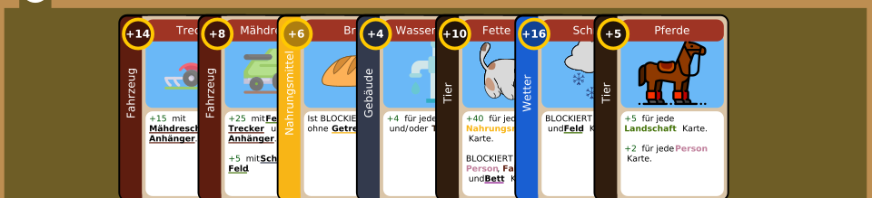
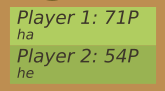
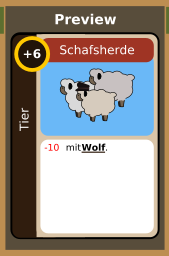
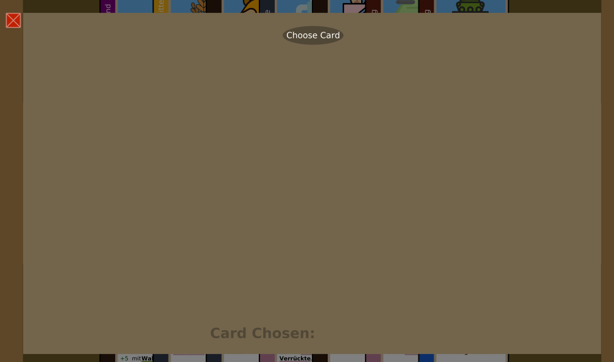

# Forword
This game was created as a group project for a university course. To import it, it was required to copy the original repository. No changes have been made since 2023.

# ProjectAPP2023

### Projectname

Die Bremer Stadtmusikanten

### Instructions to compile the program

In order to successfully compile the programm you need to have ant and java installed properly.
The program runs on Java Version 11.0.19

1. Go to the 'projectapp2023' folder
2. Write ant in the command line
3. You can find the game.jar in the dist folder

### Instruction to run the program

If you want to play the game use 'java -cp .:dist/game.jar bauernhof.test.MainTest' with the preferred settings added to that command. Please type --help to see the available options. For example, if you intent to run a local game with four RANDOM_AI players called foo, bar, bas and bus, you can use the following command:

'java -cp .:dist/game.jar bauernhof.test.MainTest -c bauernhof.xml -pt RANDOM_AI RANDOM_AI RANDOM_AI RANDOM_AI -pn foo bar bas bus'

### How to play: GUI

The player on turn, which in the beginning is Player 1, can see their cards in the lower part of the screen.
On the upper part are the cards of the next player. Those areas are called player hand areas, and in case there are 3 or 4 players,
on the left and right side accordingly, more player hand areas will be present.

The white circle in the player hand area shows the number of the player whose hand of cards the area is showing.

In the middle are the player numbers according to sequence of turns, the player names and their current points.

Above that there is a circle showing the player on turn and a square showing which round the game is in. 

In order for the players to have a better look at their cards, they can right-click them and a preview window will open in the middle of the screen displaying the card. When the preview window is opened, players cannot open the disposal and draw pop up windows or select a card to be returned from their own hand or end their turn. 

Players can also see other players hands and preview their cards by right clicking them. If a player is previewing a card from one hand area they cannot swhich the preview to a card from another hand area before returning the current card in preview to its previous place.

To return a card to its position, a player should click the mouse wheel.

On the right side is the draw pile and on the left is the disposal pile. In the beginning, the disposal pile is empty.

Next to both of them, there is a single darker button. If a player clicks on it, they can see the draw or disposal pop up window. 

The draw pop up window shows all available cards in the draw pile and the disposal pop up window, all the cards in the disposal pile.

On the draw pop up window, there are two white buttons on the right side, one for going to the next page, and one for returning back to the previous page.

There is also a close button on both pop up windows, which closes them.

The text "You can choose:" in the draw pop up window informs the player the name of the card they are allowed to select.

In the disposal pop up window, this is substituted with "Card chosen" text, which changes according to what the player has currently selected from the disposal pop up window.

In order to select a card to be taken, the player has the following options:
- They can pick up the top cards shown on the main board from the disposal or draw pop up on the left and right.
- They can open the draw pop up window, go to the last page and choose the last card. There they need to click the "Choose Card" button in the upper pard of the window.
- They can open the disposal pop up window and choose any card, where if the choose card button has not been clicked, it is allowed to click on a different card from the disposal pop up window. Again, to choose the card they need to click on the "Choose Card" button at the top.

The card to be taken then appears on the right side under the "Take" sign.

In order to select a return card, a player should have first selected a "take" card.
Afterwards, they have the following options:
- They can choose a card from their hand to be returned to the disposal pile.
- They can right click on the card they have taken to return it instead.

The card to be returned then appears on the left side under the "Return" sign.

After both cards have been selected, the player can click on the "End Turn" button in the middle, in order to finish their move and let the next player make their move.

### Output of --help

usage: java -jar dist/game.jar  [-c <FILE>] [-con
       <HOST>] [-d <DELAY>] [-g] [-h] [-ll <LEVEL>] [-p <PORT>] [-pc
       <COLOR ...>] [-pn <NAME ...>] [-pt <TYPE ...>]

=========================================================================

                  Die Bremer Stadtmusikanten <1.0.0>
  Authors: Maxim Barnstorf, Valeria Stankova, Eva Ristevska, Tobias Kai Lorenz Plattner

=========================================================================

Options:
 -c,--config <FILE>               The file from which the game
                                  configuration should be read.

 -con,--connect <HOST>            Connect as a client to the host.

 -d,--delay <DELAY>               Delay in milliseconds after a
                                  computerplayer has made his move.

 -g,--gui                         Show the GUI, even if no HUMAN player
                                  exists.

 -h,--help                        Print this help message and some extra
                                  information about this program.

 -ll,--loglevel <LEVEL>           The maximum log level. [ERRORS,
                                  WARNINGS, INFO, DEBUG]

 -p,--port <PORT>                 The port to be used when either hosting
                                  the game as a server or conntecting to a
                                  server as a client.

 -pc,--playerColors <COLOR ...>   The color(s) of the player(s). [RED,
                                  BLUE, ...]

 -pn,--playerNames <NAME ...>     The name(s) of the player(s).

 -pt,--playerTypes <TYPE ...>     The type(s) of the player(s). [HUMAN,
                                  RANDOM_AI, REMOTE]

 -t,--tournament <ROUNDS>         Play a tournament. (TOURNAMENTS)

 -tw,--tournamentwait             Wait for a user interaction before
                                  starting the next game in a tournament.
                                  (TOURNAMENTS)

Preset: v1.2.1 (Thu Jul 06 03:48:56 CEST 2023)
SAG: v2.1.0 (Mon Jul 03 07:30:41 CEST 2023)
Implemented optional features:
  - TOURNAMENTS
  - SIMPLE_AI
